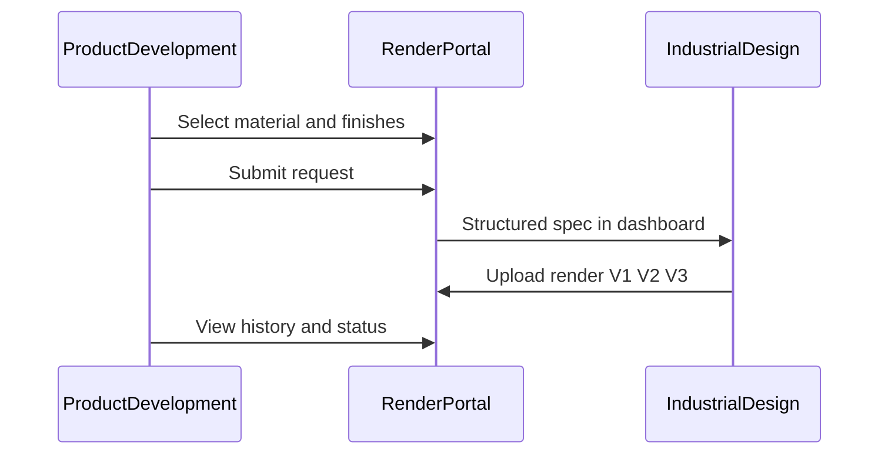

# Chapter 2 — How it works

[← 01 — Purpose](01-purpose.md) · [Project book](README.md) · **Next:** [03 — Design and Figma →](03-design-and-figma.md)

---

## End-to-end flow

1. **PD opens** the Render Portal dashboard.
2. **PD starts a render request** — product type (e.g. water bottle).
3. **PD picks finishes** from the visual Finish Library:
   - Body color / material (e.g. matte pink)
   - Logo finish (e.g. reflective silver)
   - Texture, coating, special treatments
4. **PD submits** — structured spec, not freeform spreadsheet notes.
5. **ID sees the request** on their queue — clear, visual, ready to execute.
6. **ID uploads renders** — versioned deliverables (V1, V2, V3…) back to the request.
7. **Both teams** see history, revisions, and status at any time.

---

## Request statuses

| Status | Meaning |
|--------|---------|
| Draft | PD still building the spec |
| Submitted | Ready for ID pickup |
| In Progress | ID actively working |
| Delivered | Render(s) uploaded |
| Revision Requested | PD asked for changes |

---

## MVP features

### Finish Library

- Browse materials, finishes, colors, textures
- **Visual selection** — cards and swatches, not dropdown-only forms
- Synced over time with Maria’s Figma design system
- Search and filter by category

### Render request builder

- Structured, visual spec builder
- Selections reference library items (not unstructured text alone)
- Product type, finish picks per zone (body, logo, lid, handle), notes, deadline
- Persists to D1 via the Worker API

### Shared dashboard

- **PD:** active requests, drafts, history
- **ID:** incoming queue, in-progress, delivered
- Same underlying records; role determines what each team emphasizes

### Access control

- **Cloudflare Access** (Zero Trust) for internal users only
- Worker reads `Cf-Access-Authenticated-User-Email`
- Team role (`PD`, `ID`, `GD`, `Admin`) stored in `profiles` — see [05 — Data model](05-data-model.md)

---

## Design principles

- **Visual-first** — PD users are not developers; browsing should feel natural.
- **Library is the heart** — if finishes are hard to find, the whole workflow fails.
- **Versioned renders** — ID often ships V1 → V2 → V3; history must stay visible and clean.

---

[← 01 — Purpose](01-purpose.md) · **Next:** [03 — Design and Figma →](03-design-and-figma.md)
