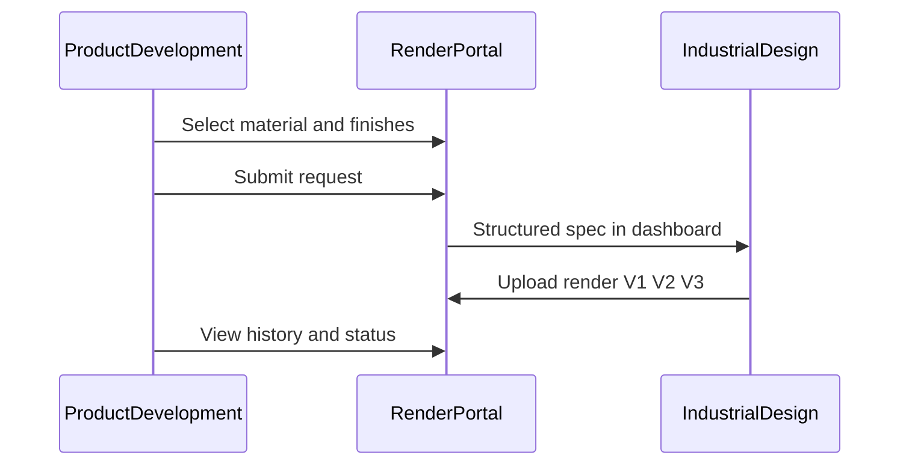

# Chapter 2 — How it works

[← 01 — Purpose](01-purpose.md) · [Project book](README.md) · **Next:** [03 — Design and Figma →](03-design-and-figma.md)

**Plain language summary:** Open the Finish Library, pick a material and finish, choose how graphics apply to the product, and watch the 3D preview update — no spreadsheets required for that step.

---

## What you see on screen (configurator tour)

**For: PD, ID, Sales, GD, C-Suite**

The live app is one full-screen page: [https://core-home-finish-library.pages.dev/configurator/](https://core-home-finish-library.pages.dev/configurator/)

| Area | What it does |
|------|----------------|
| **Top center — Material tabs** | Ceramic, Glass, S. Steel (stainless steel), Plastic. S. Steel has the fullest finish catalog today. |
| **Center — 3D preview** | A rotating product stand-in (cube for now) updates color and surface as you change finishes. Light/dark mode follows the navbar theme toggle. |
| **Left — Specs card** | Finish name, durability rating, cost tier, property notes, and **Add to Folder** (folder workflow coming later). |
| **Right — Finish Selector** | Vertical scroll wheel: swatch + label, up/down arrows beside the active item, fade at top and bottom. |
| **Right bottom — Search card** | Text search plus Sort (name, color spectrum, light/dark, process) and filters (color group, style, process). |
| **Bottom center — Graphic Application** | Shelf of treatments (e.g. Water Decal, Laser Etch). Pick one compatible with the selected finish. |
| **Left of shelf — Zoom controls** | Zoom in, zoom out, and 360° auto-rotate on the 3D preview. |

**How to try it:** Scroll the wheel or use the arrows, type in search, change a filter dropdown — the preview and specs card update immediately.

---

## End-to-end flow (full portal vision)

Today the **configurator** is live; the **render request dashboard** (submit spec → ID uploads V1/V2/V3) is planned for Phase 2.

1. **PD opens** the Render Portal (configurator or dashboard).
2. **PD picks material and finishes** from the visual library (live today).
3. **PD picks graphic application** on the shelf (live today).
4. **PD submits** a structured render request (coming — needs Worker + D1).
5. **ID sees the request** on their queue — clear, visual, ready to execute.
6. **ID uploads renders** — versioned deliverables back to the request.
7. **Both teams** see history, revisions, and status.

---

## Request statuses (dashboard — Phase 2)

| Status | Meaning |
|--------|---------|
| Draft | PD still building the spec |
| Submitted | Ready for ID pickup |
| In Progress | ID actively working |
| Delivered | Render(s) uploaded |
| Revision Requested | PD asked for changes |

---

## Finish Library features (live)

### Browse and select

- **Material tabs** at the top of the stage
- **Scroll wheel** with curved layout and fade — focused finish sits near the vertical center of the screen on large monitors
- **Search** by finish name
- **Sort:** Name A→Z / Z→A, color spectrum, light-to-dark, dark-to-light, process
- **Filter:** Color group, style family, process

### Preview and specs

- **3D preview** (Three.js) reflects finish color and surface character
- **Specs card** shows durability, cost tier, and notes from the catalog

### Graphic application

- **Shelf** of compatible graphic types for the selected finish
- Selection updates the preview pipeline (decals/textures expand in a later release)

---

## MVP features (roadmap)

### Render request builder

- Structured, visual spec builder tied to library item IDs
- Product type, finish picks per zone, notes, deadline
- Persists to D1 via the Worker API

### Shared dashboard

- **PD:** active requests, drafts, history
- **ID:** incoming queue, in-progress, delivered

### Access control

- **Cloudflare Access** (Zero Trust) for internal users only
- Team role (`PD`, `ID`, `GD`, `Admin`) in `profiles` — see [05 — Data model](05-data-model.md)

---

## Design principles

- **Visual-first** — PD users are not developers; browsing should feel natural.
- **Library is the heart** — if finishes are hard to find, the whole workflow fails.
- **Versioned renders** — ID often ships V1 → V2 → V3; history must stay visible and clean.

---

[← 01 — Purpose](01-purpose.md) · **Next:** [03 — Design and Figma →](03-design-and-figma.md)
