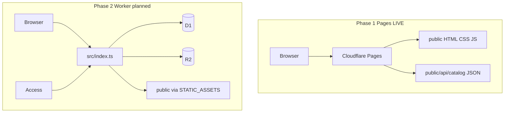
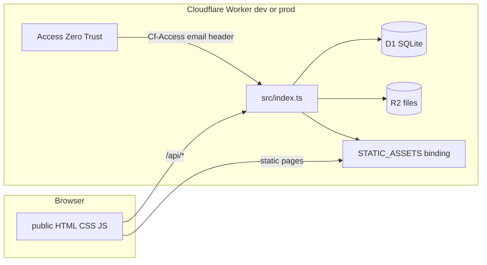

# Chapter 4 — Architecture

[← 03 — Design and Figma](03-design-and-figma.md) · [Project book](README.md) · **Next:** [05 — Data model →](05-data-model.md)

**Plain language summary:** The website is mostly static files on Cloudflare Pages; a Cloudflare Worker adds the database and file storage when Phase 2 is turned on.

---

## Stack overview

**For: WD, IT**

| Layer | Technology | Location |
|-------|------------|----------|
| Frontend | HTML, CSS, vanilla JavaScript | `public/` |
| 3D preview | Three.js (ESM via import map) | `public/js/configurator-preview-3d.js` |
| API | Cloudflare Workers (TypeScript) | `src/index.ts` |
| Database | Cloudflare D1 (SQLite) | `schema.sql`, binding `DB` |
| File storage | Cloudflare R2 | binding `RENDERS` |
| Auth | Cloudflare Access (Zero Trust) | Edge + `profiles` table |
| Static hosting | Cloudflare Pages | `public/` + GitHub Actions |
| Static catalog (Phase 1) | JSON file | `public/api/catalog` |
| Dev tooling | Cursor, Wrangler CLI | `package.json` |
| Design | Figma + optional MCP | [03 — Design and Figma](03-design-and-figma.md) |

---

## Two deployment paths



| Path | When | `/api/catalog` source |
|------|------|------------------------|
| **Pages only** | Today (production) | Static file `public/api/catalog` + `_headers` for JSON content-type |
| **Worker + D1** | Phase 2 | `GET /api/catalog` handler queries D1 |

The configurator calls `/api/catalog?material=…` on the same origin. On Pages, that file is served as static JSON (108 finishes from seed data). After Worker deploy, the same URL can be served dynamically from D1.

---

## Request path (local dev and Worker)



1. Browser loads pages from **`STATIC_ASSETS`** (or Pages CDN in Phase 1).
2. Client calls **`/api/*`** on the same origin.
3. **Cloudflare Access** adds `Cf-Access-Authenticated-User-Email` in production (Phase 2).
4. Worker resolves **profile** from D1, enforces **role** on mutating routes.
5. **Reads/writes** go to D1; render **uploads** go to R2.

---

## Worker entry behavior

[`src/index.ts`](../src/index.ts):

- Paths starting with `/api/` → `handleApi()` (when Worker handles the request)
- All other paths → `env.STATIC_ASSETS.fetch(request)` (static files from `public/`)

Before D1 queries, the Worker runs `PRAGMA foreign_keys = ON`.

---

## `STATIC_ASSETS` binding (not `ASSETS`)

**For: WD, IT**

In [`wrangler.jsonc`](../wrangler.jsonc), the assets binding is named **`STATIC_ASSETS`**.

| Name | Why |
|------|-----|
| `STATIC_ASSETS` | Works for Wrangler dev and Pages projects |
| ~~`ASSETS`~~ | **Reserved** in Cloudflare Pages — `wrangler dev` fails if used |

`pages_build_output_dir: "./public"` tells Pages which folder to publish. The same `public/` folder contains UI, `_redirects`, `_headers`, and `api/catalog`.

---

## Configurator modules

| Piece | File | Role |
|-------|------|------|
| Page shell | `public/configurator/index.html` | HUD markup, import map for Three.js |
| Layout / theme | `public/css/configurator.css` | Viewport HUD, wheel, shelf, search card |
| App logic | `public/js/configurator.js` | Wheel, browse filters, theme, API fetch |
| 3D scene | `public/js/configurator-preview-3d.js` | WebGL preview, theme background |
| Filters | `public/js/finish-wheel-filters.js` | Sort, color group, style, process |
| Grouping | `public/js/library-grouping.js` | Style families for filters and library |
| Navbar | `public/js/components/core-home-navbar.js` | Nav, theme toggle, `lumina-theme-change` |

---

## Authentication flow (Phase 2)

| Environment | Identity source |
|-------------|-----------------|
| Production | `Cf-Access-Authenticated-User-Email` header |
| Local dev | Same header if present, else `?dev_email=` or default `pd@corehome.internal` |

If email is missing → `401`. If no matching `profiles` row → `403`.

---

## Configuration

[`wrangler.jsonc`](../wrangler.jsonc):

| Setting | Value |
|---------|--------|
| `name` | `render-portal` |
| `main` | `src/index.ts` |
| `pages_build_output_dir` | `./public` |
| `assets.directory` | `./public` |
| `assets.binding` | `STATIC_ASSETS` |
| D1 | `DB` → `render-portal-db` |
| R2 | `RENDERS` → `render-portal-files` |

Replace `PASTE_YOUR_D1_ID_HERE` after `npm run db:create`.

---

## Repository layout

```text
core-home-finish-library/
├── docs/                      # Project book
├── inspiration/viewport-hud/  # Layout QA screenshots
├── public/
│   ├── configurator/index.html
│   ├── api/catalog            # Static JSON (Phase 1)
│   ├── css/configurator.css
│   ├── js/configurator.js
│   ├── _redirects
│   └── _headers
├── src/index.ts               # Worker API + asset router
├── schema.sql
├── seed.sql
├── wrangler.jsonc
└── INSTRUCTIONS.md
```

---

[← 03 — Design and Figma](03-design-and-figma.md) · **Next:** [05 — Data model →](05-data-model.md)
