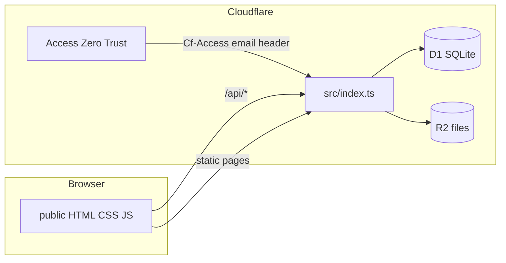

# Chapter 4 — Architecture

[← 03 — Design and Figma](03-design-and-figma.md) · [Project book](README.md) · **Next:** [05 — Data model →](05-data-model.md)

---

## Stack overview

| Layer | Technology | Location |
|-------|------------|----------|
| Frontend | HTML, CSS, vanilla JavaScript | `public/` |
| API | Cloudflare Workers (TypeScript, ES modules) | `src/index.ts` |
| Database | Cloudflare D1 (SQLite) | `schema.sql`, binding `DB` |
| File storage | Cloudflare R2 | binding `RENDERS` |
| Auth | Cloudflare Access (Zero Trust) | Edge + `profiles` table |
| Static assets | Worker assets binding | `wrangler.jsonc` → `./public` |
| Dev tooling | Cursor, Wrangler CLI | `package.json` scripts |
| Design | Figma + optional MCP | See [03 — Design and Figma](03-design-and-figma.md) |
| Version control | GitHub | `main` branch |

---

## Request path



1. Browser loads pages from the Worker **assets** binding (`/`, `/library.html`, etc.).
2. Client calls **`/api/*`** on the same origin (local: Wrangler dev server).
3. **Cloudflare Access** adds `Cf-Access-Authenticated-User-Email` in production.
4. Worker resolves **profile** from D1, enforces **role** on mutating routes.
5. **Reads/writes** go to D1; render **uploads** go to R2.

---

## Worker entry behavior

[`src/index.ts`](../src/index.ts):

- Paths starting with `/api/` → `handleApi()`
- All other paths → `env.ASSETS.fetch(request)` (static files)

Before D1 queries, the Worker runs `PRAGMA foreign_keys = ON`.

---

## Configurator 3D preview (Three.js / WebGL)

The Finish Library configurator viewport (`/configurator/`, [`public/configurator/index.html`](../public/configurator/index.html)) renders a **live WebGL preview** instead of static hero PNGs.

| Piece | Location |
|-------|----------|
| Scene module | [`public/js/configurator-preview-3d.js`](../public/js/configurator-preview-3d.js) |
| UI wiring | [`public/js/configurator.js`](../public/js/configurator.js) → `syncPreview()` |
| Three.js (ESM) | Import map in configurator HTML — `three@0.180.0` on jsDelivr |

[Three.js](https://threejs.org/) uses the browser [WebGL API](https://developer.mozilla.org/en-US/docs/Web/API/WebGL_API) to draw each frame. v1 shows a **PBR cube** (camera + lights + `OrbitControls`) whose color and surface come from:

- **Material tab** → base metalness/roughness preset (`stainless_steel`, `glass`, etc.)
- **Finish wheel** → `hexColor` + name/process heuristics (gloss, metallic, UV, powder, …)
- **Theme toggle** → scene background (light/dark)

The cube is a **stand-in** until a product GLTF replaces it (planned v3). Graphic carousel selection is wired for future texture/decals (v2).

---

## Authentication flow

| Environment | Identity source |
|-------------|-----------------|
| Production | `Cf-Access-Authenticated-User-Email` header |
| Local dev | Same header if present, else `?dev_email=` or default `pd@corehome.internal` |

If email is missing → `401`. If no matching `profiles` row → `403`.

Team role (`PD`, `ID`, `GD`, `Admin`) drives authorization (e.g. only PD/Admin create requests; only ID/Admin upload renders).

---

## Configuration

[`wrangler.jsonc`](../wrangler.jsonc):

- `name`: `render-portal`
- `main`: `src/index.ts`
- `assets.directory`: `./public`
- `d1_databases`: `render-portal-db` → binding `DB`
- `r2_buckets`: `render-portal-files` → binding `RENDERS`

Replace `PASTE_YOUR_D1_ID_HERE` after `npm run db:create`.

---

## Repository layout

```text
core-home-finish-library/
├── docs/                 # This project book
├── public/               # Static UI
│   ├── css/styles.css
│   ├── js/app.js
│   ├── index.html
│   ├── library.html
│   └── request.html
├── src/index.ts          # Worker API + asset router
├── schema.sql            # D1 schema
├── seed.sql              # Local demo data
├── wrangler.jsonc
├── package.json
└── INSTRUCTIONS.md       # Active todos (stub + checklist)
```

---

[← 03 — Design and Figma](03-design-and-figma.md) · **Next:** [05 — Data model →](05-data-model.md)
