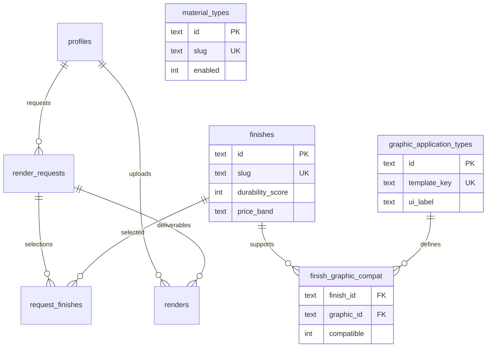

# Chapter 5 — Data model

[← 04 — Architecture](04-architecture.md) · [Project book](README.md) · **Next:** [06 — Local setup →](06-local-setup.md)

---

## D1 conventions

- **SQLite syntax only** — no PostgreSQL `gen_random_uuid()`, `SERIAL`, or array types.
- **IDs** — stable text IDs for factory imports (`fin-{slug}`, `gfx-001`); UUIDs for requests/renders.
- **Foreign keys** — enabled per request: `PRAGMA foreign_keys = ON` in [`src/index.ts`](../src/index.ts).

Canonical schema: [`schema.sql`](../schema.sql). Factory import: [finish-catalog-import.md](finish-catalog-import.md).

---

## Entity relationship



---

## Factory capability tables

### `material_types`

UI material chips (Figma zone 1). `enabled = 1` only for stainless steel in v1.

### `graphic_application_types`

One row per spreadsheet boolean column (Water Decal, Laser Engraved, etc.). `template_key` matches [`factory-library-template.json`](../data/factory-library-template.json).

### `finishes`

Factory capability rows — one per spreadsheet line on sheet `Library`.

| Column | Source column |
|--------|----------------|
| `slug` | Derived from finish name |
| `name` | Finish Name |
| `durability_score` | Durability Score |
| `durability_notes` | Durability / Finish Notes |
| `price_band` | Price (`$` … `$$$$$`) |
| `cost_tier` | Derived from price band length |
| `finish_process` | Finish Process |
| `process_steps` | # of Steps (numeric when possible) |
| `description` | Combined notes |
| `hex_color` | Generated swatch placeholder |
| `template_id` | `finish_library_ak` |

### `finish_graphic_compat`

Junction: which graphic applications each finish supports (`compatible = 1`).

---

## Workflow tables

### `profiles`

Team membership tied to Cloudflare Access email (`PD`, `ID`, `GD`, `Admin`).

### `render_requests` / `request_finishes` / `renders`

Unchanged — PD specs and ID deliverables. See prior chapters in git history for column detail.

---

## Seed data

[`seed.sql`](../seed.sql) is **generated** by `npm run import:finishes` from the factory xlsx:

```bash
npm run import:finishes
npm run db:migrate:local
npm run db:seed:local
```

---

## Implementation notes

- Configurator boot: **`GET /api/catalog`** returns materials, graphic types, and finishes with `compatibleGraphics`.
- Finish **search**: `GET /api/finishes?q=` or client filter on catalog payload.
- Re-import when the factory sends an updated spreadsheet (same template structure).

---

[← 04 — Architecture](04-architecture.md) · **Next:** [06 — Local setup →](06-local-setup.md)
