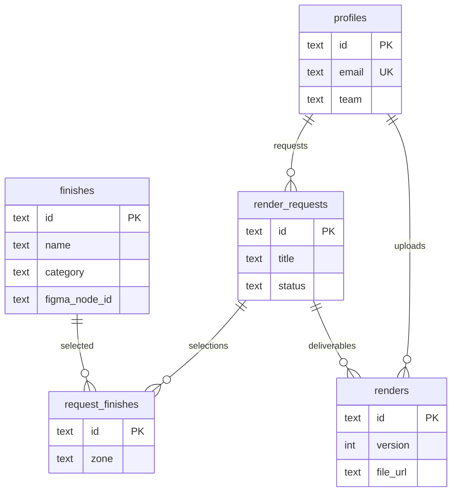

# Chapter 5 — Data model

[← 04 — Architecture](04-architecture.md) · [Project book](README.md) · **Next:** [06 — Local setup →](06-local-setup.md)

---

## D1 conventions

- **SQLite syntax only** — no PostgreSQL `gen_random_uuid()`, `SERIAL`, or array types.
- **IDs** — generated in the Worker with `crypto.randomUUID()`, stored as `TEXT`.
- **Foreign keys** — enabled per request: `PRAGMA foreign_keys = ON` in [`src/index.ts`](../src/index.ts).

Canonical schema: [`schema.sql`](../schema.sql). Apply with `npm run db:migrate` (remote) or `npm run db:migrate:local`.

---

## Entity relationship



---

## Tables

### `profiles`

Team membership tied to Cloudflare Access email.

| Column | Description |
|--------|-------------|
| `id` | UUID primary key |
| `email` | Unique; matches Access header |
| `full_name` | Display name |
| `team` | `PD`, `ID`, `GD`, or `Admin` |

### `finishes`

The Finish Library catalog.

| Column | Description |
|--------|-------------|
| `id` | UUID primary key |
| `name` | Display name (e.g. “Matte Pink”) |
| `category` | e.g. `color`, `material`, `texture`, `coating` |
| `description` | Optional detail |
| `hex_color` | Swatch color when no image |
| `image_url` | R2 or CDN URL for swatch/product |
| `figma_node_id` | Link back to Figma component for sync |

### `render_requests`

A PD-submitted (or draft) render job.

| Column | Description |
|--------|-------------|
| `id` | UUID primary key |
| `title` | Request title |
| `product_type` | e.g. water bottle, tumbler |
| `requested_by` | FK → `profiles.id` |
| `status` | `Draft`, `Submitted`, `In Progress`, `Delivered`, `Revision Requested` |
| `notes` | Freeform context for ID |
| `deadline` | ISO date string |
| `created_at`, `updated_at` | Timestamps |

### `request_finishes`

Junction: which finishes apply to which zones on a request.

| Column | Description |
|--------|-------------|
| `request_id` | FK → `render_requests.id` |
| `finish_id` | FK → `finishes.id` |
| `zone` | e.g. `body`, `logo`, `lid`, `handle` |
| `notes` | Per-zone notes |

### `renders`

ID deliverables (versioned).

| Column | Description |
|--------|-------------|
| `request_id` | FK → `render_requests.id` |
| `uploaded_by` | FK → `profiles.id` |
| `file_url` | R2 object key or public URL |
| `version` | Integer; increments per request |
| `notes` | Optional delivery notes |

---

## Seed data

[`seed.sql`](../seed.sql) adds demo profiles and finishes for local development:

```bash
npm run db:seed:local
```

---

## Implementation notes

- Finish **search** in the API uses `LIKE` on `name` and `description`; **category** filter is exact match.
- New render **version** = `MAX(version) + 1` for the same `request_id`.
- R2 keys follow `renders/{requestId}/{uuid}-{filename}` — see [08 — API reference](08-api-reference.md).

---

[← 04 — Architecture](04-architecture.md) · **Next:** [06 — Local setup →](06-local-setup.md)
