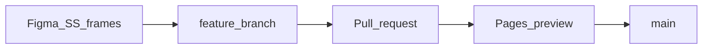

# Chapter 9 — Development workflow

[← 08 — API reference](08-api-reference.md) · [Project book](README.md) · **Next:** [10 — Roadmap and status →](10-roadmap-and-status.md)

This chapter is the **version-control bible** for Core Home Finish Library: how we use GitHub, how design and engineering work together, and how a senior contributor thinks before merging. Everyone can read it; you do not need to memorize Git commands to understand the flow.

**Repository:** https://github.com/SWFTstudios/core-home-finish-library

---

## Why version control matters here

The Finish Library is not only code. It is **catalog data in D1**, **UI in `public/`**, and **layouts in Figma** ([03 — Design and Figma](03-design-and-figma.md)). Git records *what changed, when, and why* so:

- **PD / ID** get stable specs and render history ([01 — Purpose](01-purpose.md)).
- **Graphic design (GD)** can compare shipped UI to `study_SS` and Finish Option buckets.
- **Web development (WD)** can deploy `main` without guessing what is safe.

Think of GitHub as a **shared notebook with dated pages**. Nobody erases the class poster (`main`) by accident; everyone drafts on their own sheet (branch), then the team agrees to paste the approved sheet on the poster (merge).

---

## Words everyone uses

| Word | What it means | Simple picture |
|------|----------------|----------------|
| **Repository (repo)** | The whole project on GitHub | The binder for the whole project |
| **`main`** | The official branch everyone trusts | The class poster on the wall |
| **Branch** | Your own draft copy | Your worksheet before it goes on the poster |
| **Commit** | One saved checkpoint with a note | A dated entry: “we did X because Y” |
| **Push** | Upload your branch to GitHub | Handing your worksheet to the teacher’s inbox |
| **Pull request (PR)** | “Please review and add my work to `main`” | Show-and-tell before the poster is updated |
| **Merge** | Approved work joins `main` | Gluing your approved sheet onto the poster |
| **Preview deploy** | A temporary URL for a PR branch | A practice wall to look before the real poster |

---

## Golden rules

1. **`main` stays production-ready** — after every merge, the app should still run locally and match what we are willing to ship ([phased deployment](phased-deployment.md)).
2. **Work on branches** — do not stack weeks of changes only on your laptop. That makes review and rollback almost impossible.
3. **Merge through pull requests** — even pairs should use PRs for visibility and screenshots.
4. **One logical change per commit** — the message explains **why**, not only what files moved.
5. **Never commit secrets** — no `.env`, no filled `.cursor/mcp.json` with API keys.
6. **Visual changes need three proofs** — link the **Figma frame**, attach **PR screenshots**, and note the **preview URL** when Pages preview exists.



---

## Daily rhythm

Works for 2 people or 20:

1. **Start of day** — `git fetch` and update your branch from `main` (merge or rebase per team habit).
2. **While building** — small commits on your branch with clear messages.
3. **Before break / end of day** — `git push` and open or update your PR.
4. **Review** — teammate (or GD for UI) checks diff, screenshots, test plan.
5. **Merge** — into `main`; delete the branch when done.
6. **Next day** — pull fresh `main` and start the next branch.

You do not need to run every command yourself. PD and ID often only open **Issues** and **preview links**; that still fits this rhythm.

---

## Departments and lanes

Core Home touches several groups. Same Git rules; different jobs in the PR.

| Group | Typical role | Git / GitHub | “Done” looks like |
|-------|----------------|--------------|-------------------|
| **WD** (web dev) | Worker, D1, `public/` UI, deploy | Owns `feature/` / `fix/` branches and commits | PR merged; `npm run dev` works; APIs documented if changed |
| **GD** (graphic design) | Figma, visual spec, UX copy | Reviews UI PRs; links frames; rarely commits code | Shipped UI matches `study_SS` / buckets; screenshots approved |
| **PD** (product dev) | Finish picks, render requests | Opens Issues; validates preview URLs | Can complete a spec flow on preview without spreadsheets |
| **ID** (industrial design) | Renders, deliverables | Same as PD for queue/history features | Request status and uploads work on preview |
| **Platform** | Cloudflare, CI, secrets | `chore/` branches, wrangler, GitHub Actions | Deploy docs updated; no secrets in git |

**Design + code:** GD does not have to commit to `public/js/`. The contract is: **Figma first → branch → PR with screenshots → merge**. WD implements; GD confirms visual parity.

---

## Branch naming

| Prefix | Use when | Example on this project |
|--------|----------|-------------------------|
| `feature/` | New capability | `feature/library-browse-ux` |
| `fix/` | Bug fix | `fix/library-detail-close` |
| `chore/` | Tooling, CI, config | `chore/pages-deploy-workflow` |
| `docs/` | Project book only | `docs/git-workflow-bible` |

Sync from `main` before starting new work. Keep each PR **small and focused**—one feature or fix, not “everything since January.”

---

## Commits

Use [Conventional Commits](https://www.conventionalcommits.org/):

| Prefix | Meaning |
|--------|---------|
| `feat:` | New capability |
| `fix:` | Bug fix |
| `docs:` | Documentation only |
| `chore:` | Tooling, dependencies |
| `refactor:` | Same behavior, cleaner structure |
| `test:` | Tests |

**Good examples (real work on this repo):**

```
feat: rebuild standards library as material → process → family browse

Why: Flat grid used wrong categories; catalog uses finish process (Paint, Powder, …).
```

```
feat: add viewport HUD layout for configurator

Why: Match Figma full-screen stage with fixed side/bottom panels.
```

```
fix: dismiss finish detail panel and normalize taxonomy icons

Why: Close control did not hide panel; invalid icon names rendered as text (e.g. blend).
```

**Bad example:**

```
feat: lots of stuff — configurator, library, navbar, deploy, fixes
```

That is one blob for a whole phase. Reviewers cannot skim history; rollbacks become painful.

**Do not:** force-push `main`, skip hooks without approval, commit secrets, or amend pushed commits unless explicitly requested.

---

## Pull requests — engineering + design contract

Open a PR when a human asks (or when your team’s policy requires it). Every UI PR should be reviewable by someone who did not write the code.

### PR body checklist

- **Summary** — what changed and why (1–3 short paragraphs or bullets).
- **Test plan** — commands and URLs, for example:
  - `npm run db:seed:local && npm run dev`
  - `http://localhost:8787/library.html`
  - `http://localhost:8787/configurator/`
- **Screenshots** — at least **375px** (phone) and **1280px** (desktop) for layout changes.
- **Figma** — link to [InteractiveFinishLibrary_COPY](https://www.figma.com/design/XY8ZVNYLrbK6OMVWNNqSBt/InteractiveFinishLibrary_COPY) with frame name (e.g. `study_SS`, `study_Finish Option - Buckets`). File key: `XY8ZVNYLrbK6OMVWNNqSBt`.
- **Breaking changes** — if `GET /api/catalog` or finish shape changed, say who must update (configurator, import script, etc.).
- **Preview** — Pages preview URL when Phase 1 deploy is enabled ([07 — Deployment](07-deployment.md)). Note: live `/api/catalog` may need Phase 2 Worker ([phased-deployment](phased-deployment.md)).

### Example: create a PR with GitHub CLI

```bash
git push -u origin HEAD

gh pr create --title "feat: standards library categorized browse" --body "$(cat <<'EOF'
## Summary
- Rebuild /library.html as Material → Process → Style family browse.
- Add library-grouping.js, library.js, library.css.

## Test plan
- [ ] npm run dev
- [ ] /library.html — chips, process nav, accordions, detail panel
- [ ] /configurator/?finish=2-tone-gloss — deep link

## Figma
study_SS; Finish Option - Buckets

## Screenshots
(attached)
EOF
)"
```

Use `gh` when asked; otherwise use the GitHub web UI with the same sections.

---

## Replay guide — how this repo should have been versioned

As of the project book update, **`main` had only a handful of commits** (scaffold → portal → docs), while a large body of work (configurator HUD, shared navbar, Pages routing, standards library browse, icon fixes) lived **only locally**. That is normal during fast prototyping; before wider team use, we **replay** the same work as a sequence of branches and PRs.

Recommended order (each merges to `main` only when `npm run dev` and key URLs still work):

| Order | Branch | What it contains |
|-------|--------|------------------|
| 1 | `feature/finish-catalog-import` | D1 seed, import script, `GET /api/catalog` |
| 2 | `feature/configurator-hud` | Viewport layout, `configurator.css`, HUD panels |
| 3 | `feature/core-home-navbar` | `CoreHomeNavbar`, theme, portal pages |
| 4 | `feature/pages-routing` | `public/configurator/index.html`, `_redirects`, Worker asset paths |
| 5 | `feature/library-browse-ux` | `library-grouping.js`, `library.html/js/css`, remove `bindLibraryPage`, catalog `category`, configurator `?finish=` |
| 6 | `fix/library-detail-and-icons` | Detail panel dismiss, `library-icons.js`, taxonomy icon map |

This is a **teaching timeline**, not a command to rewrite remote history. Use it when cleaning up local work or onboarding new contributors.

### Cleaning up uncommitted work today

**Option A (practical)** — one branch, several commits, one PR:

```bash
git checkout -b feature/phase1-library-and-configurator
# git add + commit per logical chunk (see table above)
git push -u origin feature/phase1-library-and-configurator
# open PR with full test plan
```

**Option B (cleanest history)** — separate branch and PR per row in the table. Better when 3+ reviewers or multiple departments sign off independently.

After merge, follow deploy todos in [`INSTRUCTIONS.md`](../INSTRUCTIONS.md) (Pages secrets, Worker, D1 remote).

---

## Scaling up (2–20 people, many departments)

When the team grows, keep the same habits and add guardrails:

- **Protected `main`** — no direct pushes; PR required.
- **Required reviews** — at least one WD for `src/`; GD or design delegate for `public/css/` and UI.
- **PR previews** — every PR gets a Pages preview link for GD/PD/ID without local setup.
- **GitHub Issues** — “we need library browse by material” → branch `feature/42-library-browse-ux`.
- **CODEOWNERS (optional)** — e.g. `public/css/` → GD + WD; `src/` → WD; `docs/` → anyone with `docs:` commits.

Trunk-based in plain language: **add one Lego brick at a time to `main`**, not dump a whole box once a month.

---

## Senior engineer mindset

Judgment we expect on this project (see also [`.cursorrules`](../.cursorrules)):

- **Smallest shippable diff** — `main` should always be deployable; avoid drive-by refactors in unrelated files.
- **Reuse before inventing** — extend `library-grouping.js`, `CoreHomeNavbar`, `finish-swatch.js` instead of duplicating patterns.
- **Design-led UI** — code converges on Figma (`study_SS`); if the prototype is wrong, fix Figma or document the exception in the PR.
- **Explain why** — commit messages and book chapters are for the next person, including future you.
- **Kid-friendly UX, adult-grade engineering** — large tap targets and clear labels in UI; strict data and API contracts underneath.
- **Session handoff** — note branch name, blockers, and commands in `INSTRUCTIONS.md` when stopping mid-feature.

Creativity and discipline work together: GD explores freely in Figma; WD lands intentional, reviewable slices in Git.

---

## Before you start (checklist)

1. Read [01 — Purpose](01-purpose.md) for product context.
2. Read [03 — Design and Figma](03-design-and-figma.md) if touching UI.
3. Check active items in [`INSTRUCTIONS.md`](../INSTRUCTIONS.md).
4. Follow [`.cursorrules`](../.cursorrules) when using Cursor.

---

## Definition of done

- [ ] Matches existing code style and patterns
- [ ] Visual-first UX for PD-facing surfaces (see [02 — How it works](02-how-it-works.md))
- [ ] D1 changes use SQLite syntax; UUIDs via `crypto.randomUUID()` in Worker
- [ ] No secrets in git (`.env`, `mcp.json` with keys)
- [ ] `npm run check` passes when Wrangler config changed
- [ ] `INSTRUCTIONS.md` / [10 — Roadmap](10-roadmap-and-status.md) updated if scope shifted
- [ ] Relevant project book chapter updated if behavior or setup changed
- [ ] UI PR includes Figma link + screenshots + test plan URLs

---

## Code standards

- **Smallest correct diff** — no drive-by refactors
- **Reuse** existing helpers and conventions in `public/` and `src/`
- **Comments** only for non-obvious business rules
- **Tests** when behavior is non-trivial (not required for trivial scaffolding)
- **Accessibility** — semantic HTML, keyboard-friendly controls where possible

---

## Secrets and environment

| File | Purpose |
|------|---------|
| [`.env.example`](../.env.example) | Documented env vars |
| [`.cursor/mcp.json.example`](../.cursor/mcp.json.example) | Figma + Stitch MCP templates |

Never commit filled-in `.env` or `.cursor/mcp.json`.

---

## Figma MCP setup

```bash
cp .cursor/mcp.json.example .cursor/mcp.json
# Add Figma API key locally
```

Use MCP to pull design context from [InteractiveFinishLibrary_COPY](https://www.figma.com/design/XY8ZVNYLrbK6OMVWNNqSBt/InteractiveFinishLibrary_COPY). Map `figma_node_id` when adding finishes to D1.

---

## Documentation changes

Product and technical docs live in **`docs/`** (this book). When you change setup, API, or architecture:

- Update the relevant chapter
- Keep [`README.md`](../README.md) as a short hub
- Use `INSTRUCTIONS.md` only for **active todos**, not long-form spec

Suggested commit prefix: `docs:`.

---

## Session handoff

Before ending a session with open work:

- Note **branch name** and blockers in `INSTRUCTIONS.md` if needed
- List follow-up commands (`npm run dev`, migrations, `npm run pages:deploy`, etc.)

---

[← 08 — API reference](08-api-reference.md) · **Next:** [10 — Roadmap and status →](10-roadmap-and-status.md)
