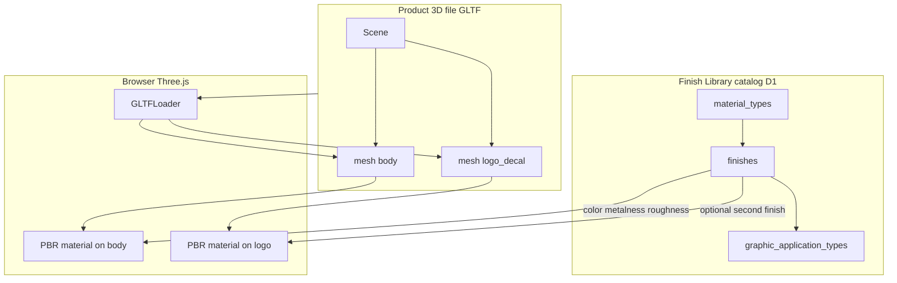

# Chapter 11 — 3D and materials primer

[← 10 — Roadmap and status](10-roadmap-and-status.md) · [Project book](README.md) · **Next:** [12 — Database and multi-material →](12-database-multi-material.md)

**Plain language summary:** A **material** is the product base (steel, ceramic, glass, plastic); a **finish** is the color and surface treatment; a **graphic** is how artwork is applied — and in 3D, those choices are painted onto **named pieces** of a model file, not onto abstract “nodes” in a spreadsheet.

---

## Finish vs material vs graphic

**For: Everyone**

Think of the configurator like ordering a custom bowl:

| Concept | Example | In the app today |
|---------|---------|------------------|
| **Material** | Stainless steel vs ceramic vs glass | Top tabs: Ceramic, Glass, S. Steel, Plastic |
| **Finish** | “Matte pink powder coat,” “2-Tone Gloss” | Finish wheel + specs card |
| **Graphic application** | Laser etch, water decal, silkscreen | Graphic Application shelf |

- **Material** sets the *family* of finishes and default surface behavior (how shiny or metallic things tend to look).
- **Finish** is one specific swatch from the factory catalog (name, hex color, durability, process).
- **Graphic** is a decoration *method* that may only work with certain finishes (compatibility matrix in the database).

These three layers are stored in the **catalog** (database). They are separate from the **3D product file** (the tumbler, bottle, etc.).

---

## How catalog data connects to what you see in 3D

**Today (shipped):** the preview uses a **placeholder cube**. One finish colors the **entire** cube. Catalog data still drives the color and surface *style*.

**Target:** load a real **GLB** model; apply different finishes to different **zones** (body vs logo).

---

## What is a 3D model file?

**For: PD, ID, GD, WD**

| Format | Use in this project |
|--------|---------------------|
| **GLB** | Preferred — single binary file, easy to host |
| **GLTF** | Same data as GLB, often split across `.gltf` + `.bin` + textures |

Models are created in CAD, Blender, KeyShot, or similar tools, then exported for the web.

| Storage | Purpose |
|---------|---------|
| **Cloudflare R2** | Holds the actual `.glb` bytes (like a file cabinet) |
| **D1 (database)** | Holds metadata: which file, which material it is for, mesh-to-zone mapping |

The browser does not read Excel for 3D shape — only the GLB file plus mapping rules from the API.

---

## Meshes vs “nodes” — the question everyone asks

**For: ID, WD, GD**

People say “node” in different ways. In this project we mean:

| Term | What it actually is | Used for |
|------|-------------------|----------|
| **Mesh** | A named chunk of 3D geometry in the GLB (e.g. `Body`, `Logo_Decal`) | Applying finishes in Three.js |
| **Zone** | Product language: `body`, `logo`, `lid`, `handle` | Render requests + configurator (future) |
| **Material slot** | A material index inside the GLB file | Fallback when mesh names vary by export |
| **Figma node ID** | Layer ID in Figma (`figma_node_id` on a finish row) | 2D design library — **not** automatic 3D binding |

**Do materials attach to nodes differently based on their data?**

- **In the database:** No. Finish rows store **catalog facts** (color, process, durability). They will link to a **material** (steel, ceramic, …). They can link to a **zone** when building a render *request* (`body`, `logo`).
- **In the 3D engine:** Yes, but at the **mesh** level. The app looks up “zone `body`” → mesh names `["Body_Mesh","BODY"]` → applies the active finish’s color and PBR settings to those meshes only.

Different **materials** (ceramic vs steel) change:

1. Which finish rows appear in the wheel (after we filter the catalog per material).
2. Default **metalness / roughness** presets before finish-specific tweaks.

Different **zones** change **which part of the model** gets the paint, not a different database “node type.”

---

## How a finish changes the way a surface looks (PBR)

**For: WD · overview for ID/GD**

Real-time preview uses **physically based rendering (PBR)**. The main knobs:

| Parameter | Plain meaning | Example |
|-----------|---------------|---------|
| **Color** | Base paint color | From `hex_color` on the finish row |
| **Metalness** | How metallic (0 = plastic/ceramic, 1 = metal) | Higher for steel, electroplate names |
| **Roughness** | How shiny vs matte | Low = gloss; high = matte / powder |
| **Emissive** (optional) | Glow | Some UV finish names today |

**Shipped today:** [`public/js/configurator-preview-3d.js`](../public/js/configurator-preview-3d.js) uses:

- `MATERIAL_PRESETS` per material tab (steel, glass, ceramic, plastic)
- `inferFinishAppearance()` — guesses extra tweaks from finish **name** and **process** (gloss, powder, metallic, ombré, …)

**Build later:** store explicit metalness/roughness (and glass **transmission**) on each finish row so we rely less on name guessing. See [12 — Database](12-database-multi-material.md).

---

## One finish on the whole model vs per zone

| Mode | Status | Behavior |
|------|--------|----------|
| **Whole model** | Shipped | One selected finish updates the entire preview mesh |
| **Per zone** | Planned | Body finish + logo finish can differ on the same GLB |
| **Per render request** | Planned | PD picks finishes per zone; ID fulfills from that spec |

The `request_finishes` table already has a `zone` column for render requests. Future work aligns that column with `product_model_zones` in the database and mesh names in the GLB. See [13 — 3D preview pipeline](13-3d-preview-pipeline.md).

---

## Glossary

| Term | Definition |
|------|------------|
| **Catalog** | All finishes, materials, and graphic types served by `/api/catalog` |
| **D1** | Cloudflare’s SQLite database for this project |
| **R2** | Cloudflare object storage for files (GLB models, render uploads) |
| **GLB / GLTF** | Standard 3D file formats for web |
| **Mesh** | Named geometry group inside a GLB |
| **Zone** | Product part label (`body`, `logo`, …) mapped to meshes |
| **PBR** | Physically based rendering — metalness, roughness, color |
| **PBR material** | Three.js material object applied to a mesh (not the same as “material tab”) |
| **Material tab** | UI chip: ceramic, glass, stainless steel, plastic |
| **Finish row** | One catalog entry (swatch + metadata) |
| **Graphic application** | Decoration method (laser etch, decal, …) |
| **Compatibility** | Which graphics work with which finish (`finish_graphic_compat`) |
| **Static catalog** | `public/api/catalog` JSON used on Pages until live D1 |
| **Worker** | Cloudflare app serving `/api/*` and optional auth |

---

## Decision log (short)

| Decision | Why |
|----------|-----|
| Finishes get `material_slug` in a future migration | Ceramic and steel finishes are not the same rows; API must filter by tab |
| Zones map to **mesh names**, not Figma node IDs | 3D runtime only understands the GLB scene graph |
| GLB in R2, metadata in D1 | Large files do not belong inside SQLite |
| Start with one default GLB per material | Simpler than arbitrary uploads in v1 |

---

## What to read next

| Role | Next chapter |
|------|----------------|
| PD / factory data | [12 — Database and multi-material](12-database-multi-material.md) |
| ID / 3D assets | [13 — 3D preview pipeline](13-3d-preview-pipeline.md) |
| WD | [12](12-database-multi-material.md) → [13](13-3d-preview-pipeline.md) → [05 — Data model](05-data-model.md) |
| Leadership | [10 — Roadmap](10-roadmap-and-status.md) (catalog + 3D milestones) |

---

[← 10 — Roadmap and status](10-roadmap-and-status.md) · **Next:** [12 — Database and multi-material →](12-database-multi-material.md)
