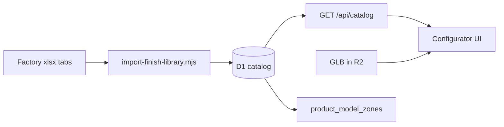

# Chapter 12 — Database and multi-material catalog

[← 11 — 3D and materials primer](11-3d-materials-primer.md) · [Project book](README.md) · **Next:** [13 — 3D preview pipeline →](13-3d-preview-pipeline.md)

**Plain language summary:** Today every finish row in D1 came from the stainless-steel factory sheet; this chapter explains how to grow the same workbook with new tabs per material, change the schema so each finish belongs to one material, and eventually store 3D model metadata alongside the catalog.

---

## Baseline — what exists today

**For: WD, IT, PD**

| Layer | Shipped today | Gap |
|-------|---------------|-----|
| **D1 schema** | [`schema.sql`](../schema.sql) — `material_types`, `finishes`, `finish_graphic_compat`, `request_finishes.zone` | `finishes` has **no `material_slug`**; ~109 rows are SS factory data |
| **API** | [`src/index.ts`](../src/index.ts) `GET /api/catalog?material=` | Returns **all** finishes; `material` is echoed but **not used to filter** |
| **UI** | [`public/js/configurator.js`](../public/js/configurator.js) | Only `stainless_steel` is `enabled=1` in seed; other tabs visible but share SS data |
| **Import** | [`scripts/import-finish-library.mjs`](../scripts/import-finish-library.mjs) | Single sheet (`Library`) from one xlsx |
| **Pages fallback** | [`public/api/catalog`](../public/api/catalog) | Static JSON until Worker + remote D1 are live |

**Document now vs build later:** Phase 0 steps are operational today. Phases 1–3 describe migrations and API changes to implement after Phase 2 infra is ready.

---

## Phase 0 — Production D1 (prerequisite)

**For: WD, IT**

Follow [07 — Deployment](07-deployment.md) and [finish-catalog-import.md](finish-catalog-import.md):

1. Create remote D1: `npm run db:create` → copy `database_id` into [`wrangler.jsonc`](../wrangler.jsonc).
2. Apply schema: `npm run db:migrate` (remote).
3. Seed catalog: `npm run db:seed` (includes factory import output when generated).
4. Deploy Worker: `npm run deploy`.
5. Retire or sync static [`public/api/catalog`](../public/api/catalog) once live API is verified.
6. **Backup D1** before any bulk re-import (Cloudflare dashboard export or documented snapshot process).

GitHub secrets (`CLOUDFLARE_ACCOUNT_ID`, `CLOUDFLARE_API_TOKEN`) must be set for CI Pages deploy; Worker deploy uses the same account.

---

## Phase 1 — Multi-material catalog (spreadsheet tabs)

**For: WD, IT, PD (overview), GD (xlsx consistency)**

### Factory workflow

Core Home will add **new tabs in the same Excel workbook** over time — one tab per material family (Ceramic, Glass, Plastic, …), matching Figma study frames (`study_Ceramic`, `study_Glass`, etc.).

| Role | Responsibility |
|------|----------------|
| **Factory / PD** | Tab names consistent (`Library_SS`, `Library_Ceramic`, …) |
| **WD** | Extend [`data/factory-library-template.json`](../data/factory-library-template.json) — per-tab column maps |
| **GD** | Swatch hex, labels, graphic compat columns aligned with template |
| **IT** | D1 backup before bulk re-import |

**Do not commit** the factory `.xlsx` to git (see `.gitignore`). Import from a secure local path or CI secret path.

### Schema change (migration — build later)

| Change | Why |
|--------|-----|
| Add `material_slug TEXT NOT NULL` (or `material_id` FK) on `finishes` | Each finish row belongs to one material |
| Optional `sheet_name` / `source_tab` on `finishes` | Traceability per xlsx tab |
| Unique index on `(material_slug, slug)` | Same finish name can differ per material |
| Update import script | Read **one tab per material** from same xlsx (map tab name → `material_types.slug`) |
| Update `GET /api/catalog` | `WHERE material_slug = ?` (or join on `material_types`) |
| Enable `material_types.enabled` per material | Turn on Ceramic/Glass/Plastic as tabs go live |

**Illustrative migration SQL (not applied yet):**

```sql
ALTER TABLE finishes ADD COLUMN material_slug TEXT NOT NULL DEFAULT 'stainless_steel';
ALTER TABLE finishes ADD COLUMN source_tab TEXT;
CREATE UNIQUE INDEX IF NOT EXISTS idx_finishes_material_slug
  ON finishes (material_slug, slug);
```

After migration, remove or relax the global `slug UNIQUE` if the same slug must exist per material.

### Import workflow (build later)

```bash
npm run import:finishes   # reads all configured tabs from xlsx
npm run db:migrate:local
npm run db:seed:local
# Regenerate static catalog for Pages if still on Phase 1 hosting:
# (project script or export step — see finish-catalog-import.md)
```

### API behavior (build later)

```http
GET /api/catalog?material=ceramic
```

Response should include only finishes where `material_slug = 'ceramic'`, plus shared `graphic_application_types` and compat rows for those finishes.

**Decision log:** Why `material_slug` on finishes? Factory data is physically separated by tab; the UI material chip must not show steel swatches on ceramic. Filtering in the API keeps one configurator codebase and prevents client-side mistakes.

---

## Phase 2 — Finish appearance metadata (optional)

**For: WD**

Today, 3D color and surface style use heuristics in [`configurator-preview-3d.js`](../public/js/configurator-preview-3d.js). Optional later storage:

| Field | Use |
|-------|-----|
| `metalness`, `roughness` | Explicit PBR per finish |
| `clearcoat` | High-gloss coatings |
| `transmission` | Glass-like materials |

Options:

- New table `finish_appearance (finish_id, metalness, roughness, …)`, or
- JSON column on `finishes` (e.g. `appearance_json`)

Reduces reliance on parsing finish **names** for gloss/powder/metallic.

---

## Phase 3 — Product models and mesh zones

**For: WD, ID**

**Build later** — ties catalog to 3D files in R2. See [13 — 3D preview pipeline](13-3d-preview-pipeline.md) for runtime behavior.

### Proposed tables

```sql
-- Illustrative — finalize in schema.sql when implementing
CREATE TABLE product_models (
  id            TEXT PRIMARY KEY,
  slug          TEXT UNIQUE NOT NULL,
  label         TEXT NOT NULL,
  material_slug TEXT NOT NULL,
  glb_r2_key    TEXT NOT NULL,
  glb_sha256    TEXT,
  default_units TEXT DEFAULT 'mm',
  created_at    TEXT DEFAULT (datetime('now'))
);

CREATE TABLE product_model_zones (
  id             TEXT PRIMARY KEY,
  model_id       TEXT NOT NULL REFERENCES product_models(id) ON DELETE CASCADE,
  zone_key       TEXT NOT NULL,   -- body, logo, lid, handle
  mesh_names     TEXT NOT NULL,   -- JSON array: ["Body_Mesh","BODY"]
  material_slot  INTEGER,         -- optional GLTF material index
  sort_order     INTEGER DEFAULT 0
);
```

### R2 layout

| Path pattern | Content |
|--------------|---------|
| `models/{product_slug}/v{version}/model.glb` | Product mesh |
| `renders/{request_id}/…` | ID deliverables (existing binding) |

Access: signed URLs from Worker or internal CDN policy. **Internal-only** until security review (size caps, Access gate).

### Link to render requests

`request_finishes.zone` must match `product_model_zones.zone_key` (e.g. `body`, `logo`). PD selects finishes per zone; ID exports renders that honor the same labels.

### Future API routes (document only)

| Route | Purpose |
|-------|---------|
| `GET /api/models` | List models (filter by `material`) |
| `GET /api/models/:slug` | Metadata + zone map + GLB URL |
| `POST /api/models` | Admin/ID upload — multipart → R2 + D1 row |

Update [05 — Data model](05-data-model.md) ER diagram and [08 — API reference](08-api-reference.md) when these ship.

---

## Data ownership summary



| Source | Destination | Owner |
|--------|-------------|-------|
| xlsx tab `Library_SS` | `finishes` + compat | PD + WD import |
| xlsx tab `Library_Ceramic` | same, `material_slug=ceramic` | PD + WD |
| GLB export from ID | R2 + `product_models` | ID + WD |
| Zone → mesh map | `product_model_zones` | ID names meshes; WD stores map |

---

## Related chapters

- Concepts: [11 — 3D and materials primer](11-3d-materials-primer.md)
- 3D stages: [13 — 3D preview pipeline](13-3d-preview-pipeline.md)
- Tables today: [05 — Data model](05-data-model.md)
- Import how-to: [finish-catalog-import.md](finish-catalog-import.md)
- Milestones M2a–M6: [10 — Roadmap](10-roadmap-and-status.md)

---

[← 11 — 3D and materials primer](11-3d-materials-primer.md) · **Next:** [13 — 3D preview pipeline →](13-3d-preview-pipeline.md)
