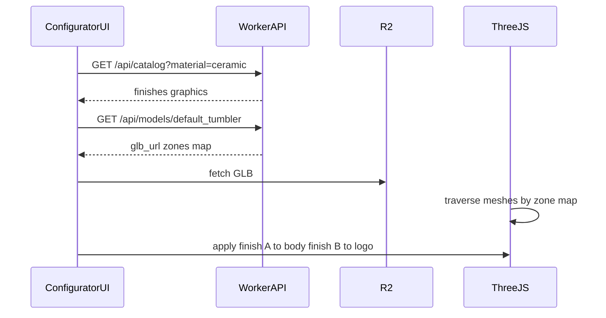

# Chapter 13 — 3D preview and model upload

[← 12 — Database and multi-material](12-database-multi-material.md) · [Project book](README.md) · [10 — Roadmap →](10-roadmap-and-status.md)

**Plain language summary:** The configurator already shows a real-time 3D cube; this chapter describes the staged path to a factory-accurate GLB tumbler, painting different finishes on different parts of the model, and eventually letting ID upload new meshes with a mesh-to-zone map.

---

## Stage 1 — Current (shipped)

**For: Everyone**

| Piece | Location |
|-------|----------|
| Preview module | [`public/js/configurator-preview-3d.js`](../public/js/configurator-preview-3d.js) |
| UI hook | [`public/js/configurator.js`](../public/js/configurator.js) calls `updatePreview3d({ materialSlug, finish, graphic, theme })` |

**Behavior:**

- Single **cube** mesh with one `MeshStandardMaterial`.
- `syncPreview()` updates color, metalness, roughness from selected finish + material preset.
- `inferFinishAppearance()` adjusts surface from finish name/process strings.
- Light/dark theme syncs with `corehome:theme-change` on `document`.

**Limitation (by design for Phase 1):** one finish colors the **whole** object. No GLTF loader yet. No per-zone materials.

---

## Stage 2 — Replace cube with default GLTF

**For: ID, WD — build later**

### Goal

Load one bundled `tumbler.glb` (or one default per `material_slug`) instead of the procedural cube.

### Implementation outline

1. Add `GLTFLoader` (Three.js examples or npm bundle).
2. Place asset under `public/models/` for Pages **or** serve from R2 via Worker URL (preferred for large files).
3. On load, apply existing PBR logic to **first mesh** or **largest mesh by triangle count** (bridge until zones exist).
4. Keep `updatePreview3d` API stable so configurator.js does not need a rewrite.

### File requirements (ID handoff)

| Requirement | Guidance |
|-------------|----------|
| Format | **GLB** (binary glTF) |
| Axis | Y-up, consistent with Three.js defaults |
| Scale | Reasonable units (mm or cm — document in `product_models.default_units`) |
| Size budget | Target **5–15 MB** per file for web; hard cap TBD with IT |
| Naming | Clear mesh names even before zone map (`Body`, `Logo`, …) |
| Compression | Draco **not** required in v1 |

---

## Stage 3 — Zone-aware materials

**For: WD, ID**

### Goal

**Body** and **logo** (and other zones) can use **different** finish rows on the same model, aligned with `request_finishes.zone` and `product_model_zones` from [12 — Database](12-database-multi-material.md).

### Runtime algorithm (build later)

1. **Load GLTF** scene into the preview canvas.
2. Fetch zone map: `zone_key` → `mesh_names[]` (and optional `material_slot`).
3. Build `Map<zoneKey, Mesh[]>` by traversing `scene.traverse()` and matching `child.name`.
4. On finish change:
   - **Whole-model mode (legacy):** update all mapped meshes with active finish.
   - **Zone mode:** UI selects active zone (body / logo); only meshes in that zone get the new PBR material.
5. Optional: when building a render request, persist per-zone finish IDs to `request_finishes`.

### UI considerations

- Zone toggle or click-to-select part (matches Figma affordances when defined).
- Specs card may show “Zone: Body” when editing.

**Decision log:** Why mesh names, not Figma node IDs? The GLTF scene graph only exposes mesh and material slot names. Figma `figma_node_id` on finishes remains for 2D library sync unless explicitly linked later.

---

## Stage 4 — User-uploaded models

**For: ID, Admin, WD — build later**

### Upload flow

1. ID or Admin uploads `.glb` via admin UI or CLI → R2 key under `models/{slug}/v{n}/model.glb`.
2. Worker stores row in `product_models` + SHA256 for cache busting.
3. **Mesh inventory** step: Worker parses GLB (or client-side traverse) and returns **mesh name list**.
4. Human assigns each zone (`body`, `logo`, …) to one or more mesh names in admin UI → `product_model_zones`.
5. Preview uses uploaded model for session or promote as new default for a material.

### Constraints to enforce

| Topic | Policy |
|-------|--------|
| Format | GLB only initially |
| Size | Hard cap (e.g. 15 MB) — reject at upload |
| Access | Cloudflare Access + team role (ID/Admin) |
| Security | Virus/malware scan policy TBD with IT; internal network only |
| CORS | R2 bucket CORS for browser fetch from Pages origin |

### Stage 4b — Graphics on mesh (later milestone)

Graphic application selection drives **decals** or normal maps on `logo` zone meshes only (not whole-body). Requires GD texture assets + shader or `DecalGeometry` path. Tracked as **M6** in [10 — Roadmap](10-roadmap-and-status.md).

---

## Code touchpoints (reference)

| Stage | Primary files |
|-------|----------------|
| 1 Shipped | `configurator-preview-3d.js`, `configurator.js` |
| 2 GLTF | `configurator-preview-3d.js`, optional `public/models/*.glb` |
| 3 Zones | `configurator-preview-3d.js`, `src/index.ts` (`/api/models`), schema migration |
| 4 Upload | New admin route + R2 put + D1 insert |

---

## Testing checklist (when implementing)

- [ ] GLB loads on Pages and Worker-hosted configurator
- [ ] Finish change updates visible color without full scene reload
- [ ] Zone map: only `logo` mesh updates when logo zone active
- [ ] Material tab switch loads correct default GLB (if per-material models)
- [ ] Theme dark/light still updates lights and background
- [ ] Mobile WebGL fallback message if context lost

---

## Related chapters

- Beginner concepts: [11 — 3D and materials primer](11-3d-materials-primer.md)
- Schema and R2 paths: [12 — Database and multi-material](12-database-multi-material.md)
- System diagram: [04 — Architecture](04-architecture.md)
- Milestones: [10 — Roadmap](10-roadmap-and-status.md)

---

[← 12 — Database and multi-material](12-database-multi-material.md) · [10 — Roadmap →](10-roadmap-and-status.md)
